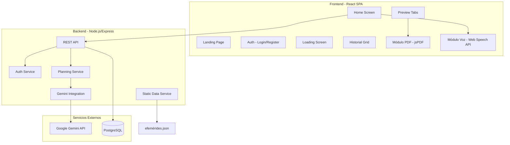
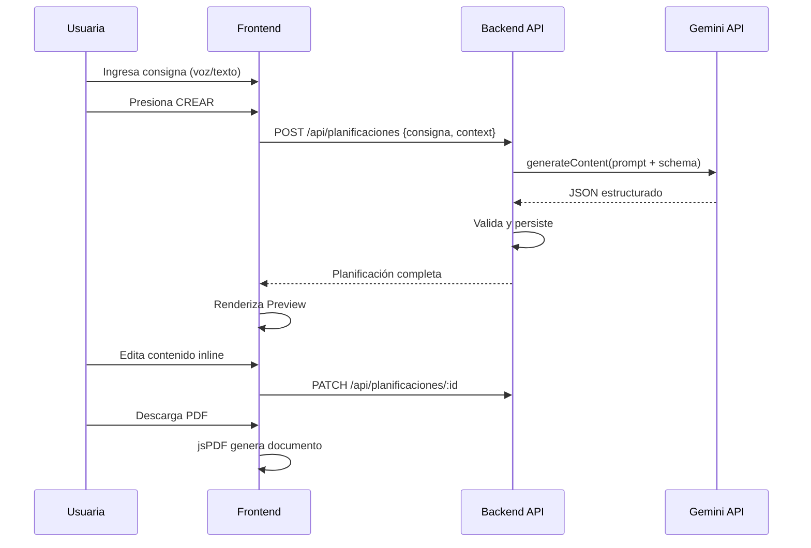
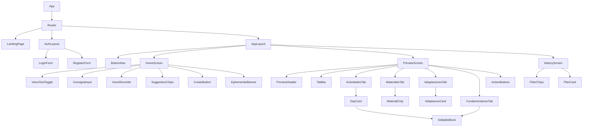
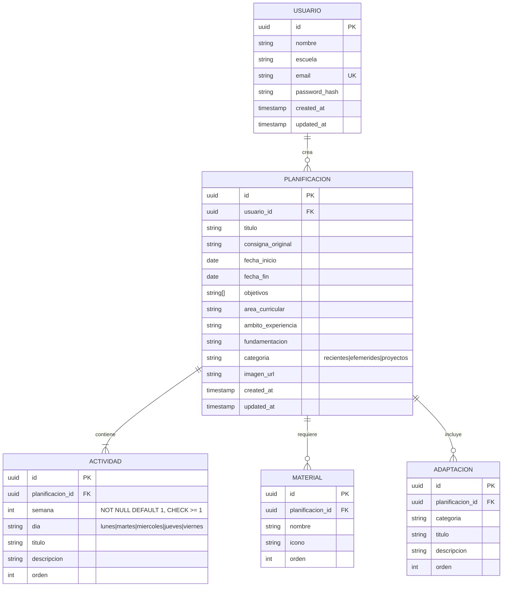

# Design Document: EduPlanner

## Overview

EduPlanner es una Single Page Application (SPA) mobile-first que permite a docentes de nivel inicial en Santa Fe, Argentina, generar planificaciones semanales completas mediante inteligencia artificial. La arquitectura sigue un modelo cliente-servidor donde el frontend React maneja la interacción, captura de voz, edición y generación de PDF, mientras un backend Node.js/Express orquesta la comunicación con Gemini API y persiste los datos.

### Decisiones Clave de Diseño

1. **React + Vite** como framework frontend por su ecosistema maduro, rendimiento en SPA y compatibilidad con Tailwind CSS.
2. **Node.js/Express** como backend por la homogeneidad del stack (JavaScript full-stack) y facilidad de integración con Gemini API SDK.
3. **jsPDF** para generación client-side de PDF sin depender del servidor.
4. **Web Speech API nativa** del navegador para reconocimiento de voz (sin librerías externas).
5. **Gemini API con JSON Schema** (structured output) para garantizar respuestas parseables.
6. **localStorage** para persistencia de sesión y cache offline de ediciones pendientes.
7. **PostgreSQL** como base de datos relacional para usuarios y planificaciones.

## Architecture

### Diagrama de Alto Nivel



### Flujo Principal



### Routing (React Router)

| Ruta | Componente | Auth Requerida |
|------|-----------|----------------|
| `/` | LandingPage | No |
| `/login` | LoginForm | No |
| `/register` | RegisterForm | No |
| `/home` | HomeScreen | Sí |
| `/preview/:id` | PreviewTabs | Sí |
| `/history` | HistoryGrid | Sí |

## Components and Interfaces

### Jerarquía de Componentes



### Interfaces de Componentes Principales

```typescript
// === Core Components ===

interface ConsignaInputProps {
  value: string;
  onChange: (text: string) => void;
  onSubmit: () => void;
  maxLength: 500;
  placeholder: string;
}

interface VoiceRecorderProps {
  onTranscript: (text: string) => void;
  onPartialTranscript: (text: string) => void;
  onError: (error: VoiceError) => void;
  maxChars: number;
  lang: 'es-AR';
}

interface EditableBlockProps {
  content: string;
  maxLength: number;
  onSave: (newContent: string) => void;
  onError: (error: SyncError) => void;
  type: 'title' | 'description' | 'fundamentacion';
}

interface PreviewHeaderProps {
  titulo: string;
  subtitulo: string;
  fechaInicio: string;
  fechaFin: string;
  objetivos: string[];
  areaCurricular: string;
}

interface TabBarProps {
  tabs: TabItem[];
  activeTab: string;
  onTabChange: (tabId: string) => void;
}

interface DayCardProps {
  dia: DiaActividad;
  colorBorder: string;
  onEdit: (field: string, value: string) => void;
  onAddActivity: () => void;
}
```

### API Endpoints

| Método | Ruta | Descripción | Body/Params |
|--------|------|-------------|-------------|
| POST | `/api/auth/register` | Registro de usuaria | `{nombre, escuela, email, password}` |
| POST | `/api/auth/login` | Inicio de sesión | `{email, password, mantenerSesion}` |
| POST | `/api/auth/logout` | Cierre de sesión | - |
| GET | `/api/auth/me` | Datos de la sesión actual | - |
| POST | `/api/planificaciones` | Crear planificación vía IA | `{consigna}` |
| GET | `/api/planificaciones` | Listar historial | `?filtro=recientes|efemerides|proyectos` |
| GET | `/api/planificaciones/:id` | Obtener planificación completa | - |
| POST | `/api/planificaciones/:id/actividades` | Agregar una actividad | `{dia, semana, titulo, descripcion}` |
| PATCH | `/api/planificaciones/:id` | Actualizar campos editados | `{path, value}` |
| DELETE | `/api/planificaciones/:id` | Eliminar planificación | - |
| GET | `/api/datos-estaticos/efemerides` | Efemérides próximas | `?dias=7` |
| GET | `/api/datos-estaticos/sugerencias` | Chips de sugerencia | - |

### Respuesta de Gemini - JSON Schema

```typescript
interface GeminiPlanificacionResponse {
  titulo: string;
  fechaInicio: string; // ISO date
  fechaFin: string;
  objetivos: string[]; // 2-4 items
  areaCurricular: string;
  ambitoExperiencia: string; // del Diseño Curricular SF
  actividades: {
    semana?: number; // entero >= 1; si falta, se asume 1
    dia: 'lunes' | 'martes' | 'miercoles' | 'jueves' | 'viernes';
    titulo: string;
    descripcion: string;
  }[];
  materiales: {
    nombre: string;
    icono: string; // emoji
  }[];
  adaptaciones: {
    categoria: string;
    titulo: string;
    descripcion: string;
  }[];
  fundamentacion: string;
}
```

## Data Models

### Diagrama ER



### TypeScript Types (Frontend)

```typescript
// === Domain Models ===

interface User {
  id: string;
  nombre: string;
  escuela: string;
  email: string;
}

interface Planificacion {
  id: string;
  titulo: string;
  consignaOriginal: string;
  fechaInicio: string;
  fechaFin: string;
  objetivos: string[];
  areaCurricular: string;
  ambitoExperiencia: string;
  fundamentacion: string;
  categoria: 'recientes' | 'efemerides' | 'proyectos';
  imagenUrl?: string;
  actividades: Actividad[];
  materiales: Material[];
  adaptaciones: Adaptacion[];
  createdAt: string;
}

interface Actividad {
  id: string;
  semana: number; // semana de la planificación (entero >= 1)
  dia: 'lunes' | 'martes' | 'miercoles' | 'jueves' | 'viernes';
  titulo: string;
  descripcion: string;
  orden: number;
}

interface Material {
  id: string;
  nombre: string;
  icono: string;
  orden: number;
}

interface Adaptacion {
  id: string;
  categoria: string;
  titulo: string;
  descripcion: string;
  orden: number;
}

// === Auth ===

interface AuthState {
  user: User | null;
  token: string | null;
  isAuthenticated: boolean;
  mantenerSesion: boolean;
}

// === Voice ===

type VoiceError = 
  | 'not-supported'
  | 'permission-denied'
  | 'no-audio'
  | 'recognition-error'
  | 'max-length';

interface VoiceState {
  isRecording: boolean;
  partialTranscript: string;
  error: VoiceError | null;
}

// === Static Data ===

interface Efemeride {
  fecha: string; // MM-DD
  nombre: string;
  descripcion: string;
  sugerenciaConsigna: string;
}

interface DatosEstaticos {
  efemerides: Efemeride[];
  estaciones: {
    nombre: string;
    meses: number[];
    sugerencias: string[];
  }[];
}
```

### State Management

Se utilizará **React Context + useReducer** para estado global (auth, planificación activa) y estado local con `useState` para componentes individuales. No se introduce Redux ni Zustand para mantener la simplicidad del stack.

```typescript
// AuthContext - Estado de autenticación global
interface AuthContextValue {
  state: AuthState;
  login: (email: string, password: string, mantener: boolean) => Promise<void>;
  register: (data: RegisterData) => Promise<void>;
  logout: () => void;
}

// PlanContext - Planificación en edición
interface PlanContextValue {
  planificacion: Planificacion | null;
  isLoading: boolean;
  error: string | null;
  crear: (consigna: string) => Promise<void>;
  updateField: (path: string, value: string) => Promise<void>;
  addActividad: (input: { dia: string; semana: number; titulo: string; descripcion: string }) => Promise<Actividad>;
  addMaterial: () => void;
  addAdaptacion: () => void;
}
```

### Estrategia de Sincronización (Edición Offline)

Las ediciones inline se guardan primero en estado local, luego se sincronizan con el backend:

1. Usuario edita → actualiza estado React inmediatamente
2. Debounce 2s → envia PATCH al backend
3. Si falla → marca como "pendiente" en localStorage
4. Retry automático (hasta 3 veces, con backoff exponencial)
5. Indicador visual de estado de sincronización por bloque

## Design System

### Paleta de Colores

| Token | Hex | Uso |
|-------|-----|-----|
| `bg-cream` | `#FBF9F5` | Fondo general |
| `green-primary` | `#4A7856` | Elementos principales, header, nav |
| `green-dark` | `#3A5F44` | Botones secundarios, hover states |
| `mostaza` | `#E9B44C` | CTAs principales, botón CREAR |
| `lavanda` | `#9B89B3` | Sección Adaptaciones |
| `text-dark` | `#2D2D2D` | Texto principal |
| `text-muted` | `#6B7280` | Texto secundario |
| `border-light` | `#E5E1DB` | Bordes de cards |

### Tipografía

- **Font family**: Quicksand (Google Fonts)
- **Títulos**: Quicksand Bold (700), sizes 24px-32px
- **Subtítulos**: Quicksand SemiBold (600), 18px-20px
- **Body**: Quicksand Medium (500), 14px-16px
- **Captions**: Quicksand Regular (400), 12px

### Componentes de UI (Tailwind Classes)

```css
/* Botón Primario (Mostaza) */
.btn-primary: bg-[#E9B44C] text-white font-bold rounded-full px-6 py-3 min-h-[56px]
              hover:brightness-110 active:scale-95 transition-all

/* Botón Secundario (Green) */
.btn-secondary: bg-[#4A7856] text-white font-bold rounded-full px-6 py-3 min-h-[56px]

/* Botón Outlined */
.btn-outlined: border-2 border-[#4A7856] text-[#4A7856] rounded-full px-6 py-3 min-h-[56px]

/* Card */
.card: bg-white rounded-xl shadow-sm border border-[#E5E1DB] p-4

/* Chip/Pill */
.chip: bg-gray-100 text-sm rounded-full px-4 py-2 min-h-[40px]

/* Input Field */
.input: bg-white rounded-xl border border-[#E5E1DB] px-4 py-3 min-h-[56px]
        focus:border-[#4A7856] focus:ring-2 focus:ring-[#4A7856]/20
```

### Colores por Día (Borde de DayCard)

| Día | Color |
|-----|-------|
| Lunes | `#4A7856` (verde) |
| Martes | `#E9B44C` (mostaza) |
| Miércoles | `#D97706` (naranja) |
| Jueves | `#92400E` (marrón) |
| Viernes | `#9B89B3` (lavanda) |

## Correctness Properties

*A property is a characteristic or behavior that should hold true across all valid executions of a system — essentially, a formal statement about what the system should do. Properties serve as the bridge between human-readable specifications and machine-verifiable correctness guarantees.*

### Property 1: Voice transcript truncation at character limit

*For any* audio transcript produced by the Web Speech API, the Módulo de Voz SHALL truncate the deposited text to exactly 500 characters and stop recording, regardless of the content or language of the spoken input.

**Validates: Requirements 1.8**

### Property 2: Text input character limit and counter visibility

*For any* string entered in the text input field, the system SHALL enforce a maximum of 500 characters and SHALL display a remaining-characters counter if and only if the current text length exceeds 400 characters.

**Validates: Requirements 2.2**

### Property 3: Suggestion chip insertion semantics

*For any* suggestion chip text and any current field state, selecting a chip SHALL result in the field containing exactly the chip text (if the field was empty) or the existing text followed by a space followed by the chip text (if the field was non-empty), with the total never exceeding 500 characters.

**Validates: Requirements 2.4, 2.5**

### Property 4: Consigna submission validation

*For any* string that is either empty (length 0) or exceeds 500 characters, pressing the CREAR button SHALL reject submission and display a validation message without invoking the backend API.

**Validates: Requirements 3.7**

### Property 5: Gemini response structural integrity

*For any* successful Gemini API response, the parser SHALL produce an object containing: a non-empty title, valid start/end dates, between 2 and 4 objectives, a non-empty area curricular, a non-empty ámbito de experiencia, at least one activity for each weekday (lunes through viernes), a materials list, an adaptaciones list, and a fundamentación text.

**Validates: Requirements 3.3, 3.5**

### Property 6: Activities grouped and ordered by week and weekday

*For any* set of activities in a planificación, the Preview Actividades tab SHALL render them grouped by week in ascending order and, within each week, by day in the fixed order lunes, martes, miércoles, jueves, viernes, with each card containing only the activities belonging to that week and that day.

**Validates: Requirements 4.4**

### Property 7: Structural preservation during inline editing

*For any* edit operation on any editable block within a planificación, the overall structure (4 tabs, day-based organization, section ordering) SHALL remain unchanged after the edit completes.

**Validates: Requirements 5.4**

### Property 8: Editable block character limits by type

*For any* editable block, the system SHALL enforce a maximum of 500 characters for title-type blocks and 2000 characters for description and fundamentación blocks, rejecting or truncating input that exceeds the respective limit.

**Validates: Requirements 5.6**

### Property 9: PDF content completeness

*For any* valid planificación, the generated PDF SHALL contain the title, date range, objectives, area curricular, all activities organized by day (lunes to viernes), all materials, all adaptaciones, and the full fundamentación text.

**Validates: Requirements 6.1**

### Property 10: PDF filename format and length constraint

*For any* planificación title and start date, the downloaded PDF filename SHALL follow the pattern "[título] - [fecha inicio].pdf" and SHALL be truncated to a maximum of 100 characters total (including extension).

**Validates: Requirements 6.6**

### Property 11: History card content completeness

*For any* planificación in the history list, its card SHALL display: an image, a date badge, the title, a description truncated to at most 80 characters, category chips, and both "Ver" and "Re-imprimir" action buttons.

**Validates: Requirements 7.1**

### Property 12: History ordering and filtering

*For any* list of planificaciones, the default and "Recientes" filter SHALL order items by creation date descending. The "Efemérides" filter SHALL return only items with category 'efemerides'. The "Proyectos" filter SHALL return only items with category 'proyectos'.

**Validates: Requirements 7.2, 7.3, 7.4, 7.5**

### Property 13: Registration form field validation

*For any* combination of form field values at submission time, the system SHALL highlight with an error indicator exactly those required fields that are empty, without clearing non-empty fields.

**Validates: Requirements 8.4**

### Property 14: Password length validation

*For any* string, the password validation SHALL accept it if and only if its length is between 6 and 72 characters inclusive.

**Validates: Requirements 8.5**

### Property 15: Email format validation

*For any* string, the email validation SHALL accept it if and only if it matches the standard email format (user@domain.extension with at least one character in each part).

**Validates: Requirements 8.6**

### Property 16: Date-to-season mapping (Southern Hemisphere)

*For any* date, the system SHALL map it to the correct Argentine season: December–February → verano, March–May → otoño, June–August → invierno, September–November → primavera.

**Validates: Requirements 12.2**

### Property 17: Ephemeris proximity detection and suggestion strategy

*For any* current date and set of ephemerides, if at least one ephemeris falls within the next 7 days, the system SHALL generate suggestion chips referencing those ephemerides and display an informational banner. If no ephemeris is within 7 days, the system SHALL generate chips based on the current season.

**Validates: Requirements 12.1, 12.3, 12.4, 14.5**

### Property 18: Suggestion chip count bounds

*For any* data state (ephemerides and season data), the Home screen SHALL display between 2 and 5 suggestion chips inclusive, never more, never fewer.

**Validates: Requirements 14.4**

### Property 19: Personalized greeting contains user name

*For any* authenticated user with a registered name, the Home screen greeting SHALL contain that user's name as a substring.

**Validates: Requirements 14.1**

## Error Handling

### Estrategia General

El sistema implementa un enfoque de error handling en capas:

| Capa | Estrategia | UX |
|------|-----------|-----|
| **Red/Conectividad** | Retry con backoff exponencial (3 intentos) | Toast con "Sin conexión, reintentando..." |
| **Validación Frontend** | Prevención de envío + mensajes inline | Bordes rojos + texto descriptivo bajo el campo |
| **API Backend** | Códigos HTTP estándar + mensajes amigables | Modal o inline según gravedad |
| **Gemini API** | Timeout 30s + parsing validation | Pantalla de error con botón Reintentar |
| **PDF Generation** | Try/catch en jsPDF | Toast con opción Reintentar |
| **Web Speech API** | Feature detection + error events | Fallback a texto + notificación |

### Manejo de Errores por Módulo

**Módulo de Voz:**
- Browser no soporta → ocultar botón, solo texto
- Permiso denegado → mensaje informativo, mantener texto disponible
- Error durante grabación → preservar texto parcial, notificar
- Silencio 10s → auto-stop con notificación
- Límite 500 chars → auto-stop con notificación de límite

**Generación IA:**
- Timeout 30s → "No pudimos generar tu planificación. ¿Querés reintentar?"
- Respuesta malformada → "Hubo un problema procesando la respuesta. ¿Reintentamos?"
- Error de red → "Sin conexión. Verificá tu internet y reintentá."

**Edición y Sincronización:**
- Fallo de persistencia → guardar local + indicador visual + retry automático (3x)
- Conflicto de versión → última escritura gana (optimistic concurrency)
- Offline → queue de cambios en localStorage, sync al reconectar

**Autenticación:**
- Credenciales inválidas → mensaje genérico (sin revelar existencia de email)
- Email duplicado → "Este email ya tiene una cuenta asociada"
- Error de servidor → "No pudimos completar el registro. Intentá de nuevo."

### Códigos de Error API

```typescript
enum ApiErrorCode {
  VALIDATION_ERROR = 'VALIDATION_ERROR',      // 400
  UNAUTHORIZED = 'UNAUTHORIZED',              // 401
  NOT_FOUND = 'NOT_FOUND',                   // 404
  CONFLICT = 'CONFLICT',                     // 409 (email duplicado)
  AI_GENERATION_FAILED = 'AI_GENERATION_FAILED', // 502
  AI_TIMEOUT = 'AI_TIMEOUT',                 // 504
  AI_PARSE_ERROR = 'AI_PARSE_ERROR',         // 422
  INTERNAL_ERROR = 'INTERNAL_ERROR',         // 500
}
```

## Testing Strategy

### Enfoque Dual: Unit Tests + Property-Based Tests

La estrategia combina tests específicos por ejemplo con tests de propiedades universales para cobertura comprehensiva.

### Property-Based Testing

**Library**: [fast-check](https://github.com/dubzzz/fast-check) (JavaScript/TypeScript)

**Configuración**: Mínimo 100 iteraciones por property test.

**Tag format**: `Feature: edu-planner, Property {N}: {texto}`

Cada propiedad del documento de Correctness Properties se implementa como un único property-based test:

| Property | Módulo bajo test | Generadores necesarios |
|----------|-----------------|----------------------|
| 1 | VoiceRecorder | Arbitrary strings (0-2000 chars) |
| 2 | ConsignaInput | Arbitrary strings (0-600 chars) |
| 3 | SuggestionChips + ConsignaInput | Arbitrary chip text + field state |
| 4 | CreateButton validation | Arbitrary strings (include empty, >500) |
| 5 | GeminiResponseParser | Arbitrary JSON objects matching/violating schema |
| 6 | ActividadesTab | Arbitrary activity arrays with mixed weeks and days |
| 7 | EditableBlock | Arbitrary edit operations on planificación state |
| 8 | EditableBlock | Arbitrary strings per block type |
| 9 | PdfGenerator | Arbitrary valid planificación objects |
| 10 | PdfGenerator (filename) | Arbitrary titles + dates |
| 11 | PlanCard | Arbitrary planificación summaries |
| 12 | HistoryFilter + sort | Arbitrary planificación lists with mixed dates/categories |
| 13 | RegisterForm validation | Arbitrary field value combinations |
| 14 | PasswordValidator | Arbitrary strings (0-200 chars) |
| 15 | EmailValidator | Arbitrary strings (valid/invalid emails) |
| 16 | SeasonMapper | Arbitrary dates |
| 17 | SuggestionService | Arbitrary dates + ephemeris sets |
| 18 | SuggestionService | Arbitrary data configurations |
| 19 | HomeGreeting | Arbitrary user names |

### Unit Tests (Example-Based)

Cubren escenarios específicos, edge cases, e integraciones:

- **Módulo de Voz**: Feature detection, permission denial, silence timeout, error preservation
- **Auth**: Login/register happy path, session persistence (localStorage vs sessionStorage)
- **Navigation**: Route guards, redirects, active tab highlighting
- **Preview**: Tab switching, empty states, default active tab
- **Landing**: Responsive rendering, CTA navigation
- **Loading Screen**: Message rotation timing

### Integration Tests

- **API → Gemini**: Full request/response cycle con mocked Gemini
- **Auth flow**: Register → Login → Access protected route → Logout
- **Edit → Sync**: Edit block → verify PATCH call → simulate failure → verify retry
- **PDF end-to-end**: Generate planificación → download PDF → verify content

### Test Runner

- **Vitest** para unit y property tests (compatible con Vite)
- **Testing Library** para component testing
- **MSW** (Mock Service Worker) para mocking de API calls en tests

