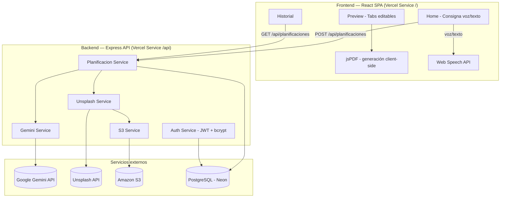
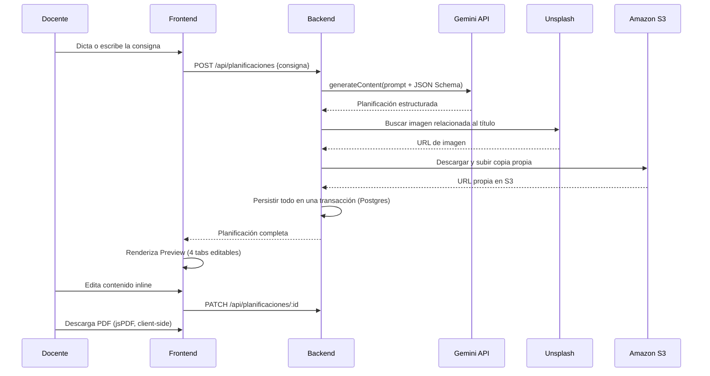
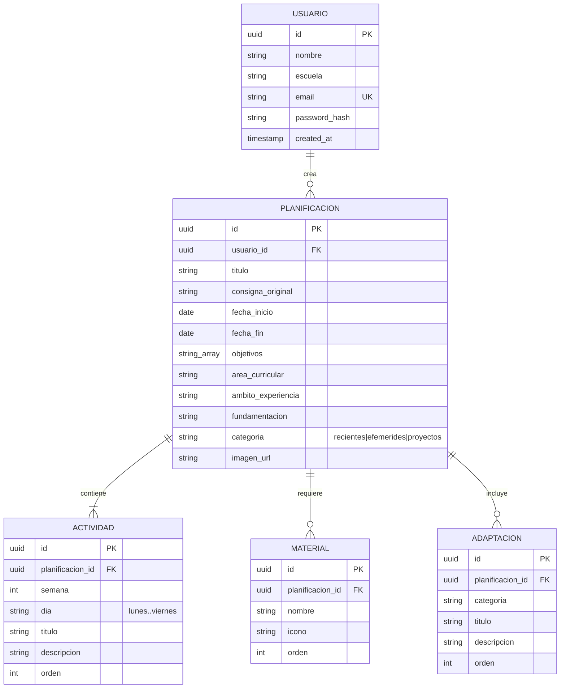

# 🌱 EduPlanner

**Planificaciones semanales de nivel inicial, generadas por IA, en menos de un minuto.**

EduPlanner es una aplicación web mobile-first pensada para docentes de **nivel inicial (jardín de infantes) de Santa Fe, Argentina**. A partir de una consigna dictada por voz o escrita ("esta semana trabajamos el otoño con sala de 4"), genera una planificación semanal completa —actividades diarias, materiales, adaptaciones de inclusión y fundamentación pedagógica— alineada con el Diseño Curricular provincial, lista para editar, imprimir o exportar a PDF.

> 🔗 **Demo en línea**: `<URL de producción en Vercel>` — completar con el dominio final del deploy.

---

## Tabla de contenidos

- [El problema](#el-problema)
- [Funcionalidades principales](#funcionalidades-principales)
- [Stack tecnológico](#stack-tecnológico)
- [Arquitectura](#arquitectura)
- [Modelo de datos](#modelo-de-datos)
- [Estructura del repositorio](#estructura-del-repositorio)
- [Puesta en marcha local](#puesta-en-marcha-local)
- [Variables de entorno](#variables-de-entorno)
- [API](#api)
- [Testing](#testing)
- [Deploy](#deploy)
- [Uso de servicios de AWS](#uso-de-servicios-de-aws)
- [Desarrollo con Kiro](#desarrollo-con-kiro)

---

## El problema

Las docentes de nivel inicial dedican varias horas por semana a redactar planificaciones que deben cumplir con el Diseño Curricular provincial: objetivos, ámbitos de experiencia, actividades por día, materiales, adaptaciones para necesidades educativas especiales y fundamentación teórica. Ese trabajo administrativo compite directamente con el tiempo de preparación real de las clases.

EduPlanner reduce ese proceso a: **decir o escribir de qué se quiere hablar esa semana → revisar y ajustar → descargar el PDF**.

## Funcionalidades principales

- 🎙️ **Consigna por voz o texto** — dictado con la Web Speech API del navegador (sin librerías externas) o entrada manual, con sugerencias contextuales (efemérides próximas, estación del año).
- 🤖 **Generación con Gemini AI** — la consigna se envía junto con el contexto curricular de Santa Fe a Gemini, que devuelve una planificación estructurada (JSON Schema) con actividades por día, materiales, adaptaciones y fundamentación.
- 🖼️ **Imagen de portada automática** — se busca una foto relacionada en Unsplash y se guarda una copia propia en Amazon S3 (independiente del link externo).
- ✏️ **Edición inline** — cada bloque de texto es editable directamente sobre la vista previa, con sincronización automática al backend.
- 📄 **Exportación a PDF** — generación 100% client-side con jsPDF, respetando semanas/días y toda la estructura de la planificación.
- 🗂️ **Historial filtrable** — planificaciones anteriores agrupadas por "Recientes", "Efemérides" y "Proyectos".
- 🔐 **Autenticación propia** — registro/login con JWT y contraseñas hasheadas con bcrypt.

## Stack tecnológico

| Capa | Tecnología |
|---|---|
| Frontend | React 19, Vite 6, TypeScript, Tailwind CSS, React Router 7 |
| Backend | Node.js, Express 5, TypeScript |
| Base de datos | PostgreSQL ([Neon](https://neon.tech), serverless) |
| IA generativa | Google Gemini API (`@google/generative-ai`) |
| Imágenes | Unsplash API + Amazon S3 |
| Autenticación | JWT (`jsonwebtoken`) + `bcryptjs` |
| PDF | jsPDF (client-side) |
| Testing | Vitest, Testing Library, MSW, fast-check (property-based testing) |
| Hosting | Vercel (frontend + backend como *Services* en un solo proyecto) |

## Arquitectura



### Flujo de creación de una planificación



**Por qué estas decisiones:**
- **Vercel Services**: frontend y backend viven en el mismo proyecto/dominio, sin CORS ni configuración de rutas cruzadas — `/api/*` rutea al servicio Express, el resto al SPA de Vite.
- **Neon (Postgres serverless)**: compatible con el modelo de funciones serverless de Vercel (sin conexiones persistentes de larga duración), con connection pooling incorporado.
- **PDF client-side**: evita mantener un servicio de renderizado en el backend; el navegador genera el documento con los datos ya cargados en memoria.
- **Copia propia en S3**: la app no depende de que Unsplash mantenga viva la URL original de cada imagen.

## Modelo de datos



Las migraciones SQL están en [`backend/src/db/migrations`](backend/src/db/migrations).

## Estructura del repositorio

```
.
├── frontend/                  # SPA React + Vite
│   └── src/
│       ├── components/        # Componentes de UI (Preview, Historial, Voz, etc.)
│       ├── contexts/          # AuthContext, PlanContext (Context + useReducer)
│       ├── layouts/           # AppLayout, AuthLayout
│       ├── pages/             # LandingPage, HomePage, HistoryPage, etc.
│       └── services/          # pdf.service.ts, suggestion.service.ts
│
├── backend/                   # API REST Express
│   └── src/
│       ├── routes/            # auth.ts, planificaciones.ts, datos-estaticos.ts
│       ├── services/          # gemini, unsplash, s3, auth, planificacion
│       ├── db/                # connection.ts, migrations/
│       ├── models/            # tipos y ApiErrorCode
│       └── data/              # efemérides.json (datos estáticos)
│
├── shared/                    # Tipos TypeScript compartidos entre frontend y backend
│   └── types.ts
│
├── .kiro/                     # Specs de desarrollo guiado con Kiro (ver sección dedicada)
│   ├── specs/edu-planner/     # requirements.md, design.md, tasks.md
│   └── steering/              # convenciones del proyecto
│
└── vercel.json                # Configuración de Vercel Services (frontend + backend)
```

## Puesta en marcha local

### Requisitos

- Node.js 20+
- Una base PostgreSQL (local o [Neon](https://neon.tech) gratis)
- API keys: [Google AI Studio](https://aistudio.google.com/apikey) (Gemini) y [Unsplash Developers](https://unsplash.com/developers)
- Opcional: cuenta de AWS con un bucket S3 (ver [Uso de servicios de AWS](#uso-de-servicios-de-aws))

### Pasos

```bash
git clone <url-del-repo>
cd <repo>

# Backend
cd backend
npm install
cp .env.example .env   # completar con tus credenciales, ver tabla abajo
npm run migrate        # crea las tablas en la base configurada
npm run dev             # http://localhost:3001

# Frontend (en otra terminal)
cd frontend
npm install
npm run dev             # http://localhost:5173
```

El frontend usa rutas relativas (`/api/...`); en desarrollo, Vite proxea automáticamente esas llamadas al backend.

## Variables de entorno

Definidas en `backend/.env` (ver [`.env.example`](backend/.env.example)):

| Variable | Requerida | Descripción |
|---|---|---|
| `DB_HOST`, `DB_PORT`, `DB_NAME`, `DB_USER`, `DB_PASSWORD` | Sí | Conexión a PostgreSQL |
| `DB_SSL` | Sí en Neon | `true` para bases con SSL (Neon lo requiere) |
| `DB_POOL_MAX` | No | Tamaño del pool de conexiones (default 10; bajar a 1-2 en entornos serverless) |
| `PORT` | No | Puerto local del backend (default 3001, no aplica en Vercel) |
| `JWT_SECRET` | Sí | Secreto para firmar los tokens de sesión |
| `GEMINI_API_KEY` | Sí | API key de Google AI Studio |
| `UNSPLASH_ACCESS_KEY` | Sí | **Access Key** de Unsplash (no confundir con el Secret Key) |
| `AWS_REGION`, `AWS_S3_BUCKET`, `AWS_ACCESS_KEY_ID`, `AWS_SECRET_ACCESS_KEY` | No | Si no están configuradas, la app sigue funcionando usando el link directo de Unsplash |

## API

Todas las rutas bajo `/api`. Las rutas de `planificaciones` requieren un JWT válido (`Authorization: Bearer <token>`).

| Método | Ruta | Descripción |
|---|---|---|
| POST | `/api/auth/register` | Registro de usuaria |
| POST | `/api/auth/login` | Inicio de sesión |
| POST | `/api/planificaciones` | Crea una planificación vía IA (Gemini + Unsplash + S3) |
| GET | `/api/planificaciones` | Lista el historial (`?filtro=recientes\|efemerides\|proyectos`) |
| GET | `/api/planificaciones/:id` | Obtiene una planificación completa |
| PATCH | `/api/planificaciones/:id` | Actualiza un campo editado inline |
| POST | `/api/planificaciones/:id/actividades` | Agrega una actividad |
| DELETE | `/api/planificaciones/:id/actividades/:actividadId` | Elimina una actividad |
| POST | `/api/planificaciones/:id/materiales` | Agrega un material |
| DELETE | `/api/planificaciones/:id/materiales/:materialId` | Elimina un material |
| DELETE | `/api/planificaciones/:id` | Elimina una planificación |
| GET | `/api/datos-estaticos/efemerides` | Efemérides próximas (`?dias=7`) |
| GET | `/api/datos-estaticos/sugerencias` | Chips de sugerencia contextual |
| GET | `/api/health` | Health check |

## Testing

```bash
# Backend
cd backend && npm test

# Frontend
cd frontend && npm test
```

El proyecto combina **tests unitarios** (casos puntuales, integraciones con MSW) con **property-based testing** (fast-check, mínimo 100 iteraciones por propiedad) sobre invariantes del sistema — por ejemplo: límites de caracteres en la consigna, orden de actividades por semana/día, formato del nombre del PDF, validación de email/contraseña. El detalle completo de las propiedades verificadas está en [`.kiro/specs/edu-planner/design.md`](.kiro/specs/edu-planner/design.md).

## Deploy

La app se despliega como un **único proyecto de Vercel** usando [Vercel Services](https://vercel.com/docs/services): frontend y backend se buildean por separado pero comparten dominio, definidos en [`vercel.json`](vercel.json):

```json
{
  "services": {
    "frontend": { "root": "frontend", "framework": "vite" },
    "backend": { "root": "backend", "framework": "express" }
  },
  "rewrites": [
    { "source": "/api/(.*)", "destination": { "service": "backend" } },
    { "source": "/(.*)", "destination": { "service": "frontend" } }
  ]
}
```

El backend corre como función serverless (no usa `app.listen()` en producción); la base de datos es Neon (Postgres serverless con connection pooling), pensada para ese modelo de ejecución.

**Flujo de ramas**: la rama de producción configurada en Vercel es `deploy` — los cambios se integran primero en `main` y luego se promueven a `deploy` para salir a producción.

## Uso de servicios de AWS

**Amazon S3** se usa para guardar una copia propia de la imagen de portada de cada planificación ([`backend/src/services/s3.service.ts`](backend/src/services/s3.service.ts)):

1. Se busca una imagen relacionada al título en Unsplash.
2. El backend la descarga una única vez y la sube al bucket S3 del proyecto.
3. Se persiste la URL propia (`https://<bucket>.s3.<region>.amazonaws.com/...`) en la base, en vez del link externo de Unsplash.

Esto evita que la app dependa de la disponibilidad del link externo (rate limits, expiración, caída del proveedor) y le da a EduPlanner control total sobre sus propios assets. Si las credenciales de AWS no están configuradas, el sistema degrada de forma segura y sigue usando la URL de Unsplash directamente, sin romper la creación de la planificación.

## Desarrollo con Kiro

El diseño y la implementación de EduPlanner siguieron un flujo **spec-driven** con Kiro, documentado en [`.kiro/specs/edu-planner`](.kiro/specs/edu-planner):

- [`requirements.md`](.kiro/specs/edu-planner/requirements.md) — requisitos funcionales en formato EARS (user stories + acceptance criteria), con un glosario de dominio específico del proyecto.
- [`design.md`](.kiro/specs/edu-planner/design.md) — arquitectura, modelo de datos, contratos de API, sistema de diseño y **19 propiedades de corrección** (correctness properties) que después se implementaron como property-based tests.
- [`tasks.md`](.kiro/specs/edu-planner/tasks.md) — plan de implementación desglosado en tareas trazables a los requisitos.
- [`steering/`](.kiro/steering) — convenciones fijas del proyecto (idioma de commits, workflow de git).

Este enfoque permitió mantener trazabilidad completa entre "qué debía hacer la app" (requirements) y "cómo se verificó que lo hacía" (properties → tests), en vez de depender solo de tests ad-hoc.
