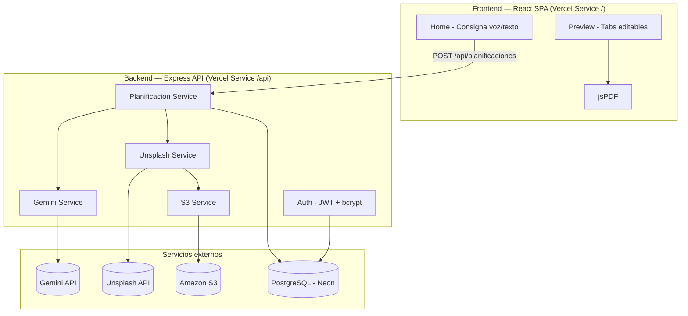

# 🌱 EduPlanner

**Planificaciones semanales de nivel inicial, generadas por IA, en menos de un minuto.**

App mobile-first para docentes de **nivel inicial (jardín de infantes) de Santa Fe, Argentina**. A partir de una consigna dictada por voz o escrita ("esta semana trabajamos el otoño con sala de 4"), genera una planificación semanal completa —actividades diarias, materiales, adaptaciones de inclusión y fundamentación pedagógica— alineada con el Diseño Curricular provincial, lista para editar, imprimir o exportar a PDF.

> 🔗 **Demo en línea**: `<URL de producción en Vercel>`

## Funcionalidades

- 🎙️ **Consigna por voz o texto** — Web Speech API del navegador, con sugerencias contextuales (efemérides próximas, estación del año).
- 🤖 **Generación con Gemini AI** — devuelve una planificación estructurada (JSON Schema) con actividades por día, materiales, adaptaciones y fundamentación.
- 🖼️ **Imagen de portada automática** — se busca en Unsplash y se guarda una copia propia en Amazon S3, independiente del link externo.
- ✏️ **Edición inline** con sincronización automática al backend.
- 📄 **Exportación a PDF** 100% client-side (jsPDF).
- 🗂️ **Historial filtrable** por "Recientes", "Efemérides" y "Proyectos".
- 🔐 **Autenticación propia** con JWT + bcrypt.

## Stack

| Capa | Tecnología |
|---|---|
| Frontend | React 19, Vite 6, TypeScript, Tailwind CSS, React Router 7 |
| Backend | Node.js, Express 5, TypeScript |
| Base de datos | PostgreSQL ([Neon](https://neon.tech), serverless) |
| IA generativa | Google Gemini API |
| Imágenes | Unsplash API + Amazon S3 |
| PDF | jsPDF (client-side) |
| Testing | Vitest, Testing Library, MSW, fast-check (property-based) |
| Hosting | Vercel (frontend + backend como *Services* en un solo proyecto) |

## Arquitectura



**Decisiones clave:**
- **Vercel Services**: frontend y backend en el mismo proyecto/dominio — `/api/*` rutea al backend, el resto al SPA (config en [`vercel.json`](vercel.json)).
- **Neon**: Postgres serverless con connection pooling, compatible con funciones serverless de Vercel.
- **PDF client-side**: sin servicio de renderizado en el backend.
- **Copia propia en S3**: la app no depende de que Unsplash mantenga viva cada URL.

**Modelo de datos**: `usuario → planificacion → {actividad, material, adaptacion}` (relaciones 1-a-muchos). Ver migraciones en [`backend/src/db/migrations`](backend/src/db/migrations).

## Estructura del repo

```
frontend/src/    # components, contexts (Auth/Plan), pages, services (pdf, sugerencias)
backend/src/     # routes (auth, planificaciones, datos-estaticos), services (gemini, unsplash, s3), db/migrations
shared/types.ts  # tipos TypeScript compartidos
.kiro/           # specs de desarrollo guiado con Kiro (ver más abajo)
vercel.json      # config de Vercel Services
```

## Puesta en marcha local

Requisitos: Node 20+, una base Postgres (local o [Neon](https://neon.tech) gratis), API keys de [Gemini](https://aistudio.google.com/apikey) y [Unsplash](https://unsplash.com/developers).

```bash
# Backend
cd backend
npm install
cp .env.example .env   # completar credenciales
npm run migrate
npm run dev             # http://localhost:3001

# Frontend (otra terminal)
cd frontend
npm install
npm run dev             # http://localhost:5173, proxea /api al backend
```

### Variables de entorno (`backend/.env`, ver [`.env.example`](backend/.env.example))

| Variable | Requerida | Descripción |
|---|---|---|
| `DB_HOST/PORT/NAME/USER/PASSWORD` | Sí | Conexión a PostgreSQL |
| `DB_SSL` | Sí en Neon | `true` para bases con SSL |
| `JWT_SECRET` | Sí | Firma de tokens de sesión |
| `GEMINI_API_KEY` | Sí | API key de Google AI Studio |
| `UNSPLASH_ACCESS_KEY` | Sí | Access Key de Unsplash (no el Secret Key) |
| `AWS_REGION/S3_BUCKET/ACCESS_KEY_ID/SECRET_ACCESS_KEY` | No | Sin esto, usa el link directo de Unsplash como fallback |

## API

Todo bajo `/api`; las rutas de `planificaciones` requieren `Authorization: Bearer <token>`.

| Método | Ruta | Descripción |
|---|---|---|
| POST | `/api/auth/register`, `/api/auth/login` | Registro / login |
| POST | `/api/planificaciones` | Crea una planificación vía IA (Gemini + Unsplash + S3) |
| GET | `/api/planificaciones` | Historial (`?filtro=recientes\|efemerides\|proyectos`) |
| GET / PATCH / DELETE | `/api/planificaciones/:id` | Detalle, edición inline, borrado |
| POST / DELETE | `/api/planificaciones/:id/actividades(/:id)` | Actividades |
| POST / DELETE | `/api/planificaciones/:id/materiales(/:id)` | Materiales |
| GET | `/api/datos-estaticos/efemerides`, `/sugerencias` | Datos contextuales |

## Testing

```bash
cd backend && npm test
cd frontend && npm test
```

Combina tests unitarios (con MSW para mocks de API) y **property-based testing** (fast-check, 100+ iteraciones) sobre invariantes del sistema: límites de caracteres, orden de actividades, formato de PDF, validaciones de auth. Detalle completo en [`design.md`](.kiro/specs/edu-planner/design.md).

## Deploy

Un único proyecto de Vercel usando [Services](https://vercel.com/docs/services) — frontend y backend se buildean por separado pero comparten dominio (config en [`vercel.json`](vercel.json)). El backend corre como función serverless. Rama de producción: `deploy` (los cambios se integran en `main` y se promueven a `deploy`).

## Uso de AWS

**Amazon S3** guarda una copia propia de la imagen de portada ([`s3.service.ts`](backend/src/services/s3.service.ts)): se busca la foto en Unsplash, se descarga una vez y se sube al bucket del proyecto, guardando esa URL propia en la base en vez del link externo. Si las credenciales de AWS no están configuradas, el sistema degrada de forma segura y sigue usando Unsplash directamente.

## Desarrollo con Kiro

Flujo **spec-driven** documentado en [`.kiro/specs/edu-planner`](.kiro/specs/edu-planner): [`requirements.md`](.kiro/specs/edu-planner/requirements.md) (user stories + acceptance criteria en formato EARS), [`design.md`](.kiro/specs/edu-planner/design.md) (arquitectura, modelo de datos y 19 *correctness properties* implementadas luego como property-based tests) y [`tasks.md`](.kiro/specs/edu-planner/tasks.md) (plan de implementación trazable a los requisitos).
